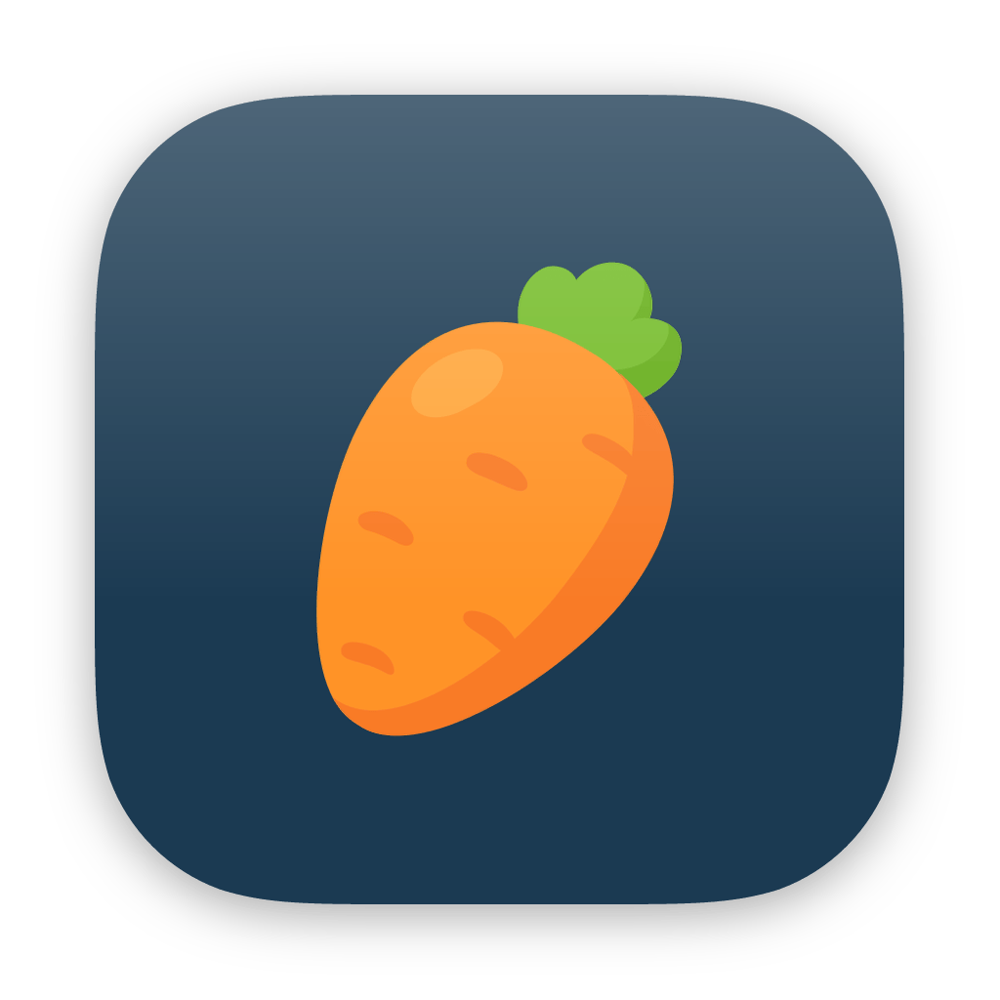
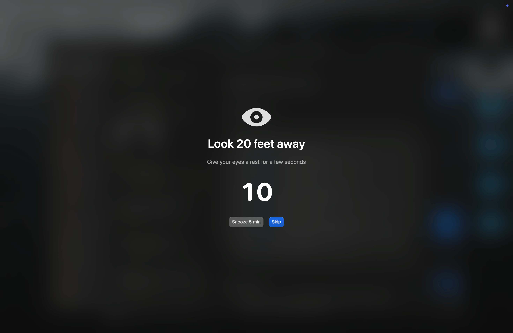

# Carrot

A menu bar app that reminds you to look away from your computer, built with [strudel](https://github.com/octavore/strudel).

## Features

- Customizable work/break intervals
- Work interval paused during screensaver and sleep
- Play sound and flash screen when break ends
- Free!



## Download

Download the latest build from the [releases page](https://github.com/octavore/carrot/releases).

## Developing

You will need [strudel](https://github.com/octavore/strudel) and Xcode.

```
strudel build [--unsigned]  # build the app
strudel build --install     # build and install to /Applications
strudel run                 # build and launch
```

## Acknowledgements

<a href="https://www.flaticon.com/free-icons/carrot" title="carrot icons">Carrot icons created by Sudowoodo - Flaticon</a>

## License

MIT
